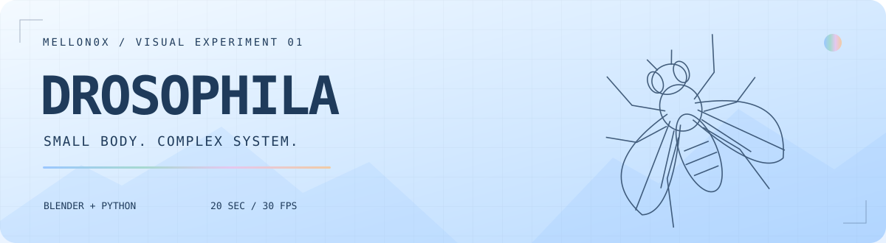
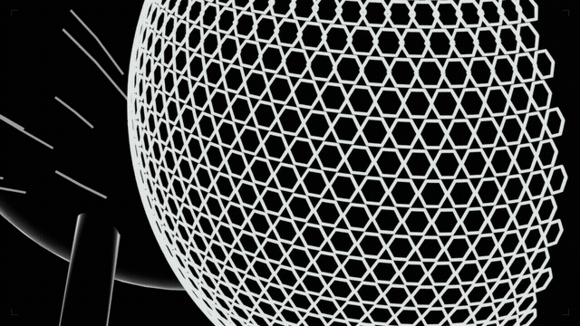

<p align="center">
  
</p>

<h1 align="center">DROSOPHILA</h1>
<p align="center"><strong>A fly. Five shots. Built in Blender.</strong></p>
<p align="center">A procedural outline edit by <a href="https://github.com/Mellon0x">Mellon0x</a>.<br/>Compound eyes, wing veins, neural pulses and a very unnecessary lowrider moment.</p>

<p align="center">
  <a href="#quick-start"></a>
  <a href="docs/setup.md"></a>
  <a href="https://x.com/Mellon0x"></a>
</p>

<p align="center"></p>
<p align="center"><a href="previews/edit-silent.mp4">▶ Full 720p silent preview</a> · <a href="assets/Drosophila.blend">↓ Blender scene</a> · <a href="docs/customize.md">✦ Customize</a></p>

<table>
<tr>
<td width="33%" align="center"><h3>01 / BUILD</h3>Procedural geometry<br/>Six articulated legs<br/>Editable Python source</td>
<td width="33%" align="center"><h3>02 / RENDER</h3>Opaque black shells<br/>Thin contour lines<br/>Cycles · CPU or GPU</td>
<td width="33%" align="center"><h3>03 / CUT</h3>Five camera sequences<br/>Typewriter overlays<br/>20 seconds · 30 fps</td>
</tr>
</table>

## `//` What is included

- A ready-to-open **Blender scene** and the script that rebuilds it from scratch.
- The complete **render → composite → MP4** pipeline, including camera impulses and lowrider motion.
- Editable cut and impulse timings, plus setup and customization guides.
- A **silent** MP4 and an animated GIF preview. **No music files, generated soundtrack or audio downloads.** Bring your own audio if you want it.

<a id="quick-start"></a>
## `//` Quick start

Tested with **Blender 5.2.1 LTS**. Use Python **3.11+**, Pillow and FFmpeg with `libx264`. Install Blender and FFmpeg separately. No fonts are bundled: Windows uses Consolas; other platforms can use DejaVu Sans Mono or set `EDIT_FONT` and `EDIT_FONT_BOLD`.

```powershell
git clone https://github.com/Mellon0x/drosophila-outline-edit.git
cd drosophila-outline-edit
python -m venv .venv
.venv\Scripts\python.exe -m pip install -r requirements.txt

# Replace this with YOUR Blender executable.
$blender = 'C:\Tools\blender\blender.exe'

# First: render one source frame. No full render needed yet.
& $blender -b assets/Drosophila.blend --python-exit-code 1 --python scripts/render.py -- --frames 90

# Then: all 600 frames. Completed PNGs are reused on restart.
& $blender -b assets/Drosophila.blend --python-exit-code 1 --python scripts/render.py

# Export a silent 20-second MP4. FFmpeg must be on PATH.
.venv\Scripts\python.exe scripts/export.py
```

**Result:** `work/drosophila.mp4` — 1280 × 720, 30 fps, H.264, no audio stream.

For NVIDIA RTX cards, add `-- --device OPTIX` to the full render command. CPU is the default. Rendering time depends on hardware; a completed source render can be reused when editing only typography or compositing.

<details>
<summary><strong>Rebuild the scene from Python</strong></summary>

```powershell
& $blender -b --python-exit-code 1 --python scripts/build_scene.py
```

This recreates `assets/Drosophila.blend`, including geometry, materials, cameras and all animation keys. It overwrites that scene file. Keep a copy first if you edited it manually. After rebuilding, rerender with `-- --overwrite` so old images are not reused.

</details>

<details>
<summary><strong>Linux / macOS commands</strong></summary>

```sh
python3 -m venv .venv
.venv/bin/python -m pip install -r requirements.txt
blender -b assets/Drosophila.blend --python-exit-code 1 --python scripts/render.py
.venv/bin/python scripts/export.py
```

These use the same portable scripts; Windows was the tested environment. Blender and FFmpeg must be on PATH. See [setup and troubleshooting](docs/setup.md) for explicit paths and fonts.

</details>

## `//` The sequence

| Shot | Source timeline | What happens |
|:--|:--|:--|
| Compound vision | 0–4 s | Start at the eye facets; pull back to reveal the fly |
| Wing structure | 4–8 s | Trace the membrane and veins |
| Neural signal | 8–12 s | Reveal an abstract network with amber pulses |
| Motor control | 12–16 s | Walk, groom, then lift the front like a lowrider |
| Flight | 16–20 s | Spread wings, take off, orbit and reveal the title |

The exporter retimes those five source shots using [`config/timing.json`](config/timing.json). Actual cut times differ slightly from the source timeline. Blender frames are **1–600**; saved PNGs are **0000–0599**.

## `//` Project map

```text
assets/Drosophila.blend     Ready scene, generated from source
scripts/build_scene.py     Model, materials, cameras, animation
scripts/render.py          Resumeable source-frame rendering
scripts/typography.py      Typewriter text and final title
scripts/export.py          Timing, bloom, optical punch, MP4
config/timing.json         Output cut times and lowrider impulses
docs/                     Setup and customization guides
previews/                 Banner, GIF, silent MP4
work/                     Your renders and exports (gitignored)
```

## `//` Make it yours

Change the author using `python scripts/export.py --author @yourname`. Edit the text in `scripts/typography.py`; adjust timings in `config/timing.json`; change geometry, camera positions and body motion in `scripts/build_scene.py`. See the [customization guide](docs/customize.md) for which changes need a rerender.

Optional local audio:

```powershell
.venv\Scripts\python.exe scripts/export.py --audio 'C:\Music\your-track.mp3' --output work/my-edit.mp4
```

This only adds your file. It does not analyze beats or automatically synchronize arbitrary songs. Choose cut and impulse times yourself. Short audio is padded with silence; long audio is cut at 20 seconds. Audio files are excluded by `.gitignore`.
